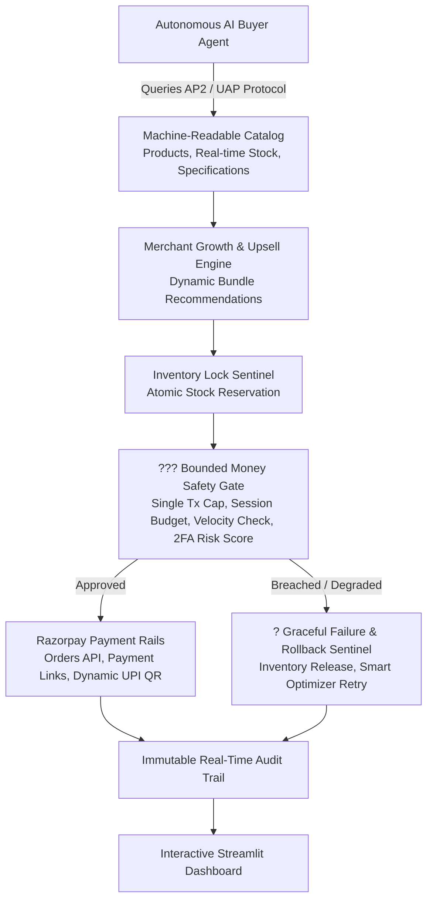

# ?? RazorAgent Commerce ? Autonomous Agent-to-Agent Commerce & Merchant Checkout Engine

[](https://www.python.org/downloads/)
[](https://streamlit.io)
[](https://razorpay.com)
[]()

> **Built for the Razorpay AI Builder Internship 2026 (Track 1: AI Growth & Agentic Commerce)**  
> **Author:** AI Builder Intern Candidate  
> **Evaluation Criteria:** Every money action explainable, bounded, and gated. Graceful failure and immutable audit trail.

---

## ?? Problem Statement & Vision

With NPCI's Universal Agentic Protocol (UAP) and the global protocol race (AP2, ACP, x402), **Agent-to-Agent (A2A) Commerce** is the defining frontier of fintech in 2026. Autonomous AI agents (consumer assistants, enterprise procurement bots) need to discover merchant offerings, negotiate bundle discounts, verify safety bounds, and transact without human friction.

**RazorAgent Commerce** turns any merchant into an AI-transactable, revenue-optimized business on Razorpay rails.

---

## ??? Architecture & Pipeline Flow



---

## ??? The Razorpay Bar: Bounded, Gated & Explainable Money Actions

To meet and exceed Razorpay's evaluation bar:
1. **Bounded Spending Policies**: Enforces strict single-purchase caps (e.g. ?5,000) and cumulative session budgets (e.g. ?15,000).
2. **Velocity Limits**: Automatically restricts rapid-fire purchasing anomalies (>3 transactions per minute) with cooldown guards.
3. **Dynamic 2FA Risk Scoring**: Computes a 0?100 risk score on every transaction; purchases triggering risk thresholds require human-in-the-loop authorization.
4. **Graceful Failure & Rollback**: When a bank gateway degrades or a transaction is aborted, the **FailureSentinel** automatically releases locked inventory and switches routing to Razorpay Optimizer smart fallback without dropping the user's cart.
5. **Immutable Audit Trail**: Logs every JSON-RPC protocol message, decision rationale, risk score, and settled transaction timestamp.

---

## ? Key Features

- **?? Autonomous AI Buyer Simulator**: Simulates external autonomous procurement bots querying the catalog, evaluating pricing, and executing checkouts.
- **?? AP2 / UAP Machine-Readable Catalog**: Standardized JSON-LD protocol schema for automated product discovery and real-time inventory queries.
- **?? Merchant Growth & Upsell Engine**: Generates dynamic cross-sell bundle discounts (15% savings) and automated checkout abandonment recovery sequences.
- **?? Razorpay Payment Rails**: Live test-mode API integration + Smart Sandbox fallback generating Razorpay Orders, short payment links, and dynamic UPI QR codes.
- **?? Immutable Audit Log**: Full visibility into every autonomous financial decision and error recovery event.

---

## ?? Quick Start (Local Setup)

```bash
# 1. Clone the repository
git clone https://github.com/uma0144/razoragent-commerce.git
cd razoragent-commerce

# 2. Install dependencies
pip install -r requirements.txt

# 3. Launch the Web Application
streamlit run app.py
```
Open `http://localhost:8501` to test the interactive dashboard.

---

## ?? Running Automated Tests

Run the full pytest suite:
```bash
python -m pytest -v
```
*(All 7 unit tests covering safety gating, inventory locks, dynamic upsells, and dropoff recovery pass with 100% success).*

---

## ?? License
MIT License
